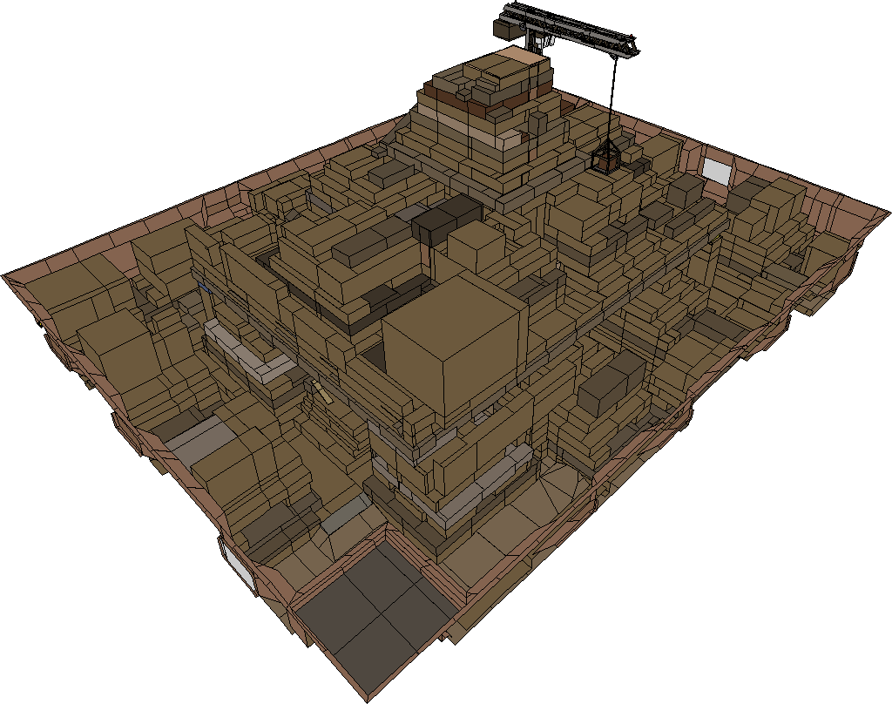
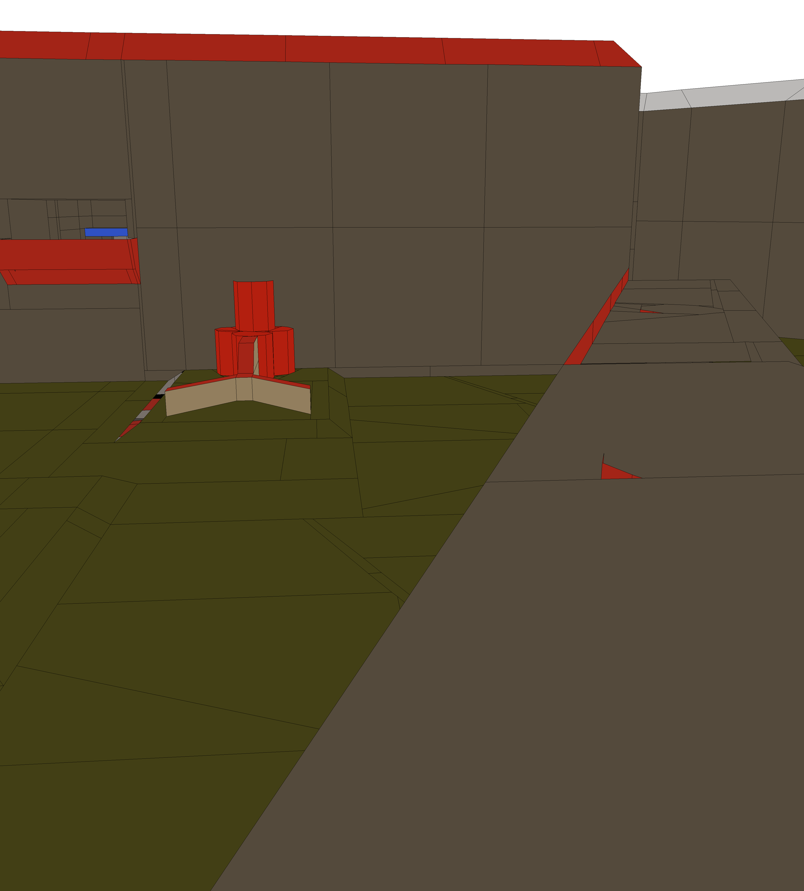
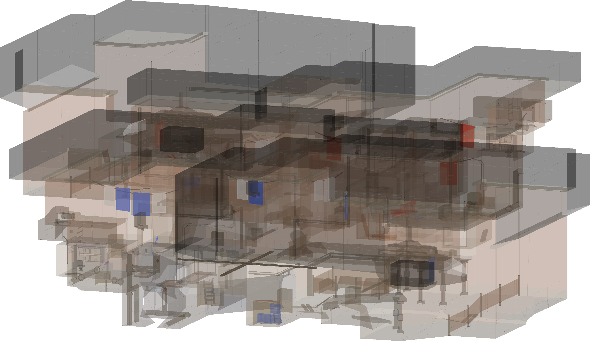

 # BSP-Hacking
 Multiple Algorithms to change Quake 2 BSP files

 1. Q2BSP class
 2. Radar Image Generator

 ## Q2BSP class
 The Q2BSP class is still WIP but is built in a way that allows easily extending it. Also, for every information loaded,
 the class contains a method for converting it back to bytes and storing it in a new .bsp file.

 To load a map, use `my_map = Q2BSP("path/to/map.bsp")`

 Example for getting the game mode of a map and changing the loading message:
     
 ```python
 game_mode = my_map.worldspawn["gamemode"]
 print(game_mode)
 my_map.worldspawn["message"] = "I edited this message!"
 my_map.update_lump_sizes()
 my_map.save_map("path/to/map.bsp", "_mod")  # The new map will be saved as map_mod.bsp
```

 ## Radar Image Generator
 The original purpose of this project was automatically generating a top view shot of maps that gives all
 the characteristic information an in-game screenshot would also provide (mostly surfaces colors and the
 map layout). In addition it now also supports rendering orthographic images at any given camera angle.

 The Radar Image Generator so far consists of four files: radar_image.py serves as the root file that will be called by
 the user. Colored_radar_image.py, wireframe_radar_image.py and heatmap_radar_image.py contain the functions required 
 to generate radar images. 
 
 These three files will now be explained more in detail.
 
 ### perspective projection rendering (mode == 0)
 colored_radar_image.py contains the most recent functionality. One rendering mode it supports is perspective projection
 rendering. That means that faces closer to the camera are displayed larger than more distant ones. This adds depth to
 an image. The default field of view (fov) is 50. 

  
 
 For every fov the faces are moved closer to or further away from the
 camera so that the highest angle between a vertice vector and the near clipping plane is the fov. The image itself is
 rescaled in such a way that the larger image size will be the set maximum resolution while the other side is smaller.
 The camera focal point is (0,0,0) while the near clipping plane (the plane all faces get projected on) is at z=1.
 
 While by default the whole map is always rendered, the scene can be moved closer to the camera, so that also images
 from the player's perspective can be rendered. This however can emphasize invisible faces that are not rendered due to
 very small angles between camera view vector and face normal.
 
 
 
 Maps can be rendered from custom or default view angles. These are
  - "front"
 - "right"
 - "back"
 - "left"
 - "top"
 - "bottom"
 - "rotated"
 
 "rotated" allows setting custom angles. If the angle is not specified, one that allows a good view at the map will be
 calculated. Additionally, setting the angle to "all" results in an image containing renderings from "top", "right",
 "front" and "rotated" view:
 
 
 
 This image can be rendered using `create_image(pball_path, "/maps/splatmesa.bsp", "all", 0, f"media/mode0.png", max_resolution=1024, x_an=0.0, y_an=0.0, z_an=0.0)
`.
 
 ### orthographic projection rendering (mode == 1)
 The most common alternative to perspective projection is orthographic projection. This projection does not distinguish
 between close and distant objects and thus brings the advantage of easier recognition of edge sizes.
 
 From a Q2BSP object the script does not only take geometry information but also face normal and texture information.
 The normal is used to determine if a face faces the camera or not. If it doesn't face the camera but
 still is rendered, it would block vision. The texture information is used by loading each texture and
 determining its mean color value. The image module used for drawing polygons (PIL) does not support textures.
 After sorting all polygons by their depth / distance to camera, they are drawn:
 
 
 
 Rendering from certain angles like this gives a good impression of both the layout and height information.
 This image can be rendered using  `create_image(pball_path, "/maps/propaint1.bsp", "rotated", 0, "output.png", x_an=0.0, y_an=15.0, z_an=50.0)`

 
 To display different perspectives on a single image, matplotlib is used:
 
 
 
 Seeing a map from different angles allows spotting information that would have been hidden otherwise.
 This image can be rendered using `create_image(pball_path, "/maps/nhb.bsp", "all", 0, "output.png")`
 
 The latter allows a custom camera angle and requires specifying the x, y, z angle.
 
 ### heatmap_radar_image.py (mode == 2)
 This mode renders all faces in a map semi-transparent. Instead of average texture colors, a heat-map like 
 color scale is used to display height or depth for fixed angles (top, side, front view).
 
 
 
 This mode is useful for displaying geometry that's hidden by outside walls.
 The image above can be rendered using `create_image(pball_path, "/maps/beta/apache_b2.bsp", "rotated", 1, "output.png")`
 
 For this mode it is also possible to draw different perspective on one image:
 
 
 
 Note how you can figure from the colors that the sewers way on the image above is one of the lowest parts of the map.
 Code: `create_image(pball_path, "/maps/wobluda_fix.bsp", "all", 1, "output.png")`
 
 For this and the following mode it is currently not possible to specify angles.
 
 ### wireframe_radar_image.py (mode == 3)
 This mode contains the least information but can in some cases still put emphasis on details that would otherwise have been missed.
 In the example below, bmodels (red) outside of the map can easily be seen. These are used for target and trigger entities
 and are not even rendered in-game.
 
 
 
 Code: `create_image(pball_path, "/maps/siegecastle.bsp", "all", 2, "output.png")`
 